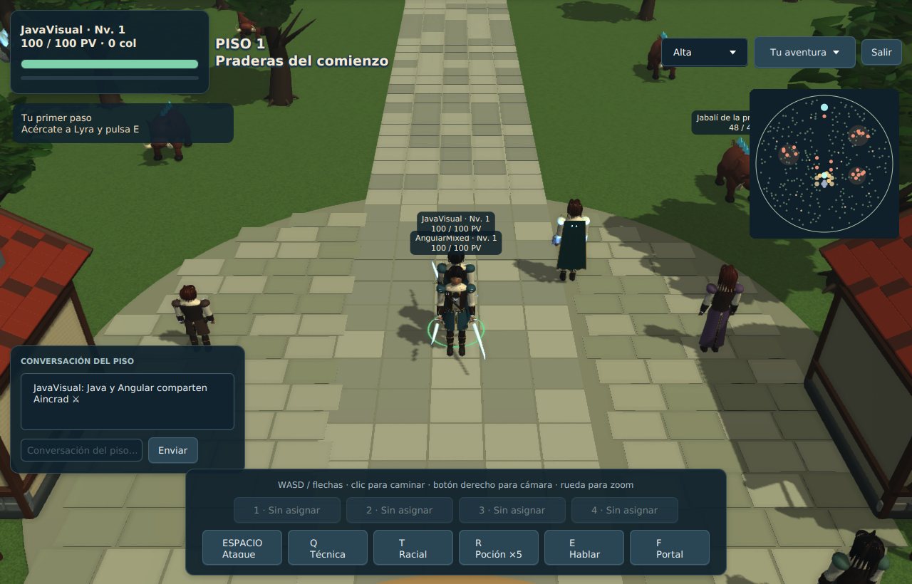
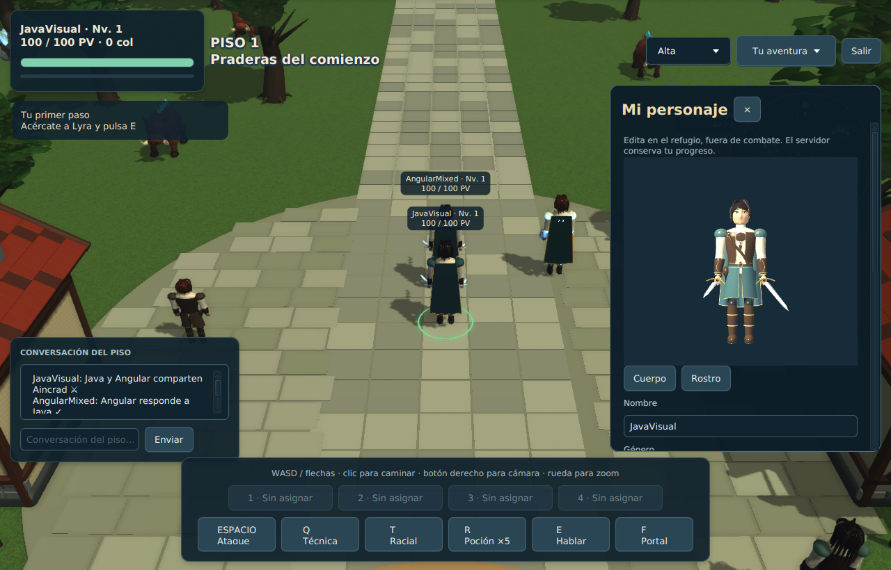

# Cliente Java y convivencia con Angular

Entrega 0.1.0 del cliente nativo para el servidor Aincrad v0.2.0, conservando la revisión de rutas por clic incorporada en main. Se añadió `client-java/`, scripts separados y esta documentación. **Los fuentes del servidor y de Angular, sus API y los compilados originales no se modifican.**

## Arranque

Desde la raíz del repositorio, con JDK 17/21 y Maven 3.9.9+:

```bash
./scripts/compilar-cliente-java.sh
./scripts/iniciar-cliente-java.sh http://localhost:8081
```

Para iniciar el servidor original continúa usando `scripts/iniciar.sh`; el cliente Java es un programa independiente. La [guía del cliente](../client-java/README.md) explica el ZIP, configuración del servidor, plataformas y controles.

## Matriz de funciones

| Función de Angular | Acceso Java | Contrato existente |
| --- | --- | --- |
| Registro, acceso y sesión | Pantalla de inicio | `/api/player/register`, `login`, `session` |
| Recuperación y restablecimiento | Recuperar / enlace recibido | `forgot-password`, `reset-password` |
| Correo, contraseña y cierre de sesión | Mi cuenta | `email`, `password`, `logout` |
| Vincular perfil anterior | Mi cuenta → clave anterior | `claim-character` |
| Selección/creación | Elige tu personaje; vista 3D | `join` con cuenta y `characterId` |
| Editar aspecto, clase y especialidad | Mi personaje | `profile` |
| Teclado, clic y minimapa | Mundo 3D | `input`, `move`, `stop` |
| Objetivos y combate | Clic, botones y teclas | `target`, `attack`, `racial`, `potion` |
| Misión, NPC, portal y pisos | E/F, diálogo | `interact`, `portal`; estado autoritativo |
| Chat e IA de NPC | Conversación / diálogo | `chat`, `npcChat`, `npcReply` |
| Armas del catálogo | Inventario | `equip` |
| Inventario artesanal | Inventario / Oficios | `craftEquip`, `craftUnequip`, `craftUpgrade` |
| Forja general | Brann / Inventario | `forgeUpgrade` |
| Mercado, compra y venta | Mercado / Bolsa | `shopBuy`, `shopBuyEquipment`, `shopSell`, `shopSellMaterial` |
| Oficios y recolección | Oficios, clic en recurso | `craft`, `gather` |
| Atributos, talentos y reparto | Talentos | `progression` |
| Habilidades y cuatro ranuras | Habilidades / teclas 1–4 | `bindSkill`, `castSkill` |
| Muñecos, DPS/HPS y contadores | Entrenamiento | `resetTraining`; estado de prácticas |
| Zonas y niveles | Zonas | Catálogo de zonas y estado de criaturas |
| PvP, ciudadanía y redención | PvP | `pvpMode`, `target`, `redeem` |
| Ilustraciones y controles | Diario / Controles | Recursos originales y catálogo |
| Calidad gráfica | Selector superior | Ajuste local; no modifica la partida |
| Mundo y todos sus catálogos root | Administración → Mundo | `/api/admin/world`, `reload` |
| Personajes, equipo, propietario, ciudadanía y oficios root | Administración → Personajes | Endpoints `characters/{id}` y sus subrutas |
| Cuentas y contraseñas root | Administración → Cuentas | `accounts`, `accounts/{id}/password` |
| Ollama, modelos y prueba de NPC | Administración → NPC/Ollama | `ai`, `ai/models`, `ai/test` |
| Correo, estado y root | Administración | `mail`, `mail/test`, `password`, `/api/health` |

La administración utiliza campos tipados y JSON por sección para cubrir objetos, listas y nuevas entradas de los catálogos. «Actualizar esta sección» aplica el borrador antes de navegar a otra sección. «Guardar y validar» también incorpora el JSON de la sección actual y bloquea JSON inválido. Guardado, validación, copias de seguridad y recarga los realiza el servidor existente.

## Renderizado

`JmeWorld` dibuja el mundo en OpenGL mediante LWJGL. `WorldView` presenta los fotogramas y etiquetas en JavaFX. `ArtLibrary` reconstruye las mallas y materiales originales, conserva articulaciones, recolorea apariencia/equipo y aplica los modelos de las criaturas e invocaciones. La vista previa utiliza la misma biblioteca geométrica.

Alta añade SSAO, mapas de normales de superficie, reflejos metálicos, bloom, FXAA, sombras direccionales PCF4 de 2048 y vegetación adicional. Los lotes espaciales de 20 metros y las mallas compartidas reducen geometría redundante. Hay dos buffers de presentación reutilizados para impedir acumulación de fotogramas. La resolución respeta proporción y escala de pantalla, con límites por calidad.

Estas son mejoras concretas del renderizador Java; la captura permite evaluar el resultado visual. La valoración estética y la fluidez deben comprobarse también en el equipo de juego. La validación aquí utilizó OpenGL por software, por lo que no certifica rendimiento de una GPU física.





## Arte reproducible

El paquete de arte se versiona en `client-java/src/main/resources/art/`. `manifest.json` registra formato, cantidades, SHA-256 del paquete y hashes de sus fuentes originales. Contiene 480 variantes de avatar, armas, NPC, siete especies, muñecos, invocaciones, árboles, edificios, recursos y portal. Las mallas compartidas se deduplican y las hojas se combinan conservando color por vértice.

Para regenerar después de modificar intencionadamente el arte Angular:

```bash
npm --prefix client ci
node client-java/tools/export-models.mjs
mvn -f client-java/pom.xml verify
```

El exportador trabaja en `client-java/target/model-export`, nunca escribe en `client/src/app`. No se ejecuta al arrancar ni necesita Node en el ZIP. Cambios de colores, escala, equipo y catálogos admitidos por el servidor se aplican con sus valores vivos. Modelos completamente nuevos requieren extender y regenerar el paquete; existe representación de reserva para tipos desconocidos.

## Red y datos

`Endpoint` acepta únicamente un origen HTTP/HTTPS. `GameClient` utiliza `HttpClient`, un almacén de cookies en memoria, `Origin`, los encabezados originales de jugador/administrador y WebSocket autenticado con `aincrad_player`. No usa claves en URL ni inventa permisos. HTTPS pasa a WSS y conserva las restricciones de cookie segura.

Las intenciones de entrada se envían a 20 Hz con secuencia; el servidor conserva su velocidad, colisiones, límites y recargas. La interpolación gráfica no modifica snapshots ni posiciones autoritativas. Se manejan mensajes WebSocket fragmentados, heartbeat, cola de envío, timeout de entrada y hasta cinco reintentos. Cerrar sesión o invalidar credenciales termina la conexión; no se cambia la política de sesiones.

Los personajes se siguen guardando exclusivamente en `data/` del servidor. No se migran cuentas ni se crean archivos de partida propios del cliente. Se puede abrir Angular y Java a la vez con personajes diferentes y el mismo servidor.

## Validación reproducible

`mvn -f client-java/pom.xml verify` ejecuta:

- 18 casos de núcleo: origen y URI, direcciones, diagonales, secuencia, parada, mensajes, chat, diálogo y filtros de catálogo.
- 2 pruebas de arte: todas las combinaciones de raza/rostro/armadura y tipos de arma; índices, normales y tangentes finitos; escala y equipo personalizados.
- 7 pruebas contra el JAR original, en un servidor y directorio temporales por caso: registro/acceso, cookies y propiedad; dos conexiones y Unicode; movimiento/velocidad/parada/destino bloqueado/secuencia; 27 intenciones reconocidas; revocación al salir; origen/autenticación rechazados; administración y respaldos.

La prueba de 27 intenciones verifica reconocimiento y continuidad de conexión, no una partida completa: varias operaciones se rechazan por requisitos de juego. Los casos de movimiento, permisos, chat, salida y administración sí verifican sus resultados. Las reglas del combate/economía siguen siendo las del servidor original.

También se ejecutaron `npm --prefix client test` y `npm --prefix client run build`. La reconstrucción conserva los compilados Angular sin cambios. La comprobación mixta abrió **Angular real en Chromium y la aplicación Java/OpenGL simultáneamente**, verificó presencia, movimiento y chat en ambos sentidos y obtuvo seis capturas Java, una Angular y un informe sin errores de navegador. Véase [`validation/mixed-result.json`](../client-java/validation/mixed-result.json).

Para repetir la prueba mixta, usa un servidor **aislado**, una cuenta Java de prueba ya creada y Playwright del proyecto. Compila el cliente Java, instala Chromium de Playwright y define:

```bash
export AINCRAD_URL=http://127.0.0.1:18081
export SAO_SMOKE_USER=cuenta_java_de_prueba
read -rs -p 'Contraseña de prueba: ' SAO_SMOKE_PASSWORD; echo
export SAO_SMOKE_PASSWORD
node client-java/tools/mixed-clients.mjs
unset SAO_SMOKE_PASSWORD
```

En Linux requiere `xvfb-run`. `CHROMIUM_PATH` permite usar Chromium existente. `SAO_QA_OUT` cambia el directorio de capturas, que por defecto es `/tmp/sao-mixed-clients`. La cuenta Java debe tener un personaje llamado `JavaVisual`, usado por las aserciones. La prueba crea una cuenta web temporal en ese servidor. No utilices tus datos de producción para esta comprobación.

## Plataformas y límites

Compilación, contratos, capturas y ZIP verificados en Linux x86_64 con Java 17 y Mesa. El código y lanzadores permiten compilar en Windows/macOS, pero sus binarios deben producirse en la plataforma correcta y aún no se probaron gráficamente aquí. El juego conserva los dos pisos y límites del prototipo Angular; no se añade contenido o servidor de cien pisos.

La cámara, efectos y decoración son locales. La navegación por clic conserva el comportamiento del servidor, incluido el rechazo de destinos bloqueados. La revisión actual de main añade rutas autoritativas alrededor de obstáculos y Java las aprovecha con el mismo protocolo. El JAR original v0.2.0 aún utiliza movimiento recto; recompila el servidor para activar las rutas según [MOVIMIENTO-POR-CLIC.md](MOVIMIENTO-POR-CLIC.md). Java no calcula ni altera rutas locales. Correo y conversaciones Ollama necesitan que esas prestaciones ya estén configuradas en el servidor.
